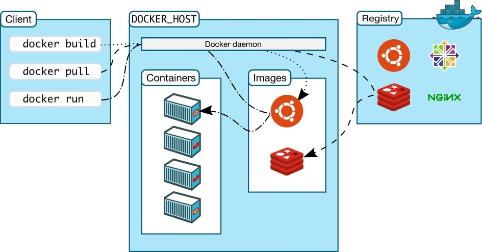
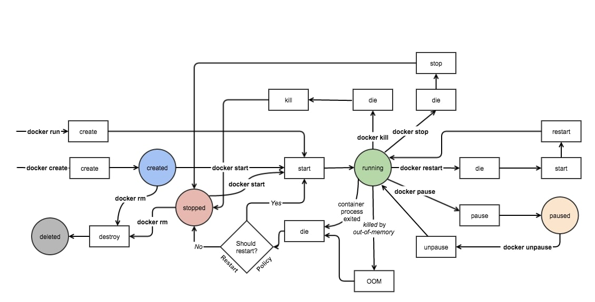

# GIT Version Control

## YouTube Video

## Commands

### Docker

- `docker pull <image>`: Pull Image from Docke Hub
- `docker create <image>`: Create a container from an Image
- `docker start <container_name/container_id>`: Start a container
- `docker stop <container_name/container_id>`: Stop a container
- `docker rm <container_name/container_id>`: Remove a container
- `docker ps`: Get all running containers
- `docker ps -a`: Get all containers
- `docker stop $(docker ps -a -q)`: Stop all containers
- `docker rm $(docker ps -a -q)`: Remove all containers
- `docker image rm $(docker image ls -q)`: Remove all images
- `docker run --name <container_name> -p <host_port>:<container_port> <image>`: Pull, create, start and run a container
- `docker run -d <image>`: Run in detached mode
- `docker run -e <key>=<value> <image>`: Run with environment variable
- `docker run -it <image> <command>`: Run a container and overwrite the default entrypoint
- `docker run -it --entrypoint <entrypoint_command> <image>`: Run a container and overwrite the default entrypoint
- `docker exec -it <image_name> <command>`: Execute a command in a running container with interactive mode
- `docker login`: Login into a Docker Repository
- `docker -v <named_volume>:<path_in_container> <image>`: Bind path in the container to a Docker volume
- `docker -v <path_in_host>:<path_in_container> <image>`: Bind path in the container to another path in the host
- `docker volume ls`: List all volumes
- `docker build <path>`: Build docker image
- `docker build --tag <image_name> <path>`: Build docker image with a tag
- `docker build - < <custom_path>`: Build docker image when the name is not `Dockerfile`
- `docker tag <image_name> <company>/<new_image_name>:<version>`: Add a Docker Repository tag to an image. It can be also used for adding more tags
- `docker login`: Log into a Docker Repository
- `docker push <company>/<new_image_name>:<version>`: Push to a Docker repository, ex: DockerHub
- `docker commit <container_name/container_id> <image>`: Create an image from a running container
- `docker logs -f --tail <lines_count> <container_name>`: Print number of lines of the container logs and keep streaming

### Docker Compose

- `docker compose build`: Build services of the docker compose
- `docker compose build <service>`: Build a service of the docker compose
- `docker compose create`: create services
- `docker compose start`: start services
- `docker compose run`: Run a command in a services
- `docker compose restart`: Restart services
- `docker compose restart <service>`: Restart a service
- `docker compose pause`: Pause services
- `docker compose unpause`: Unpause services
- `docker compose stop`: Stop services
- `docker compose rm`: Remove stopped containers
- `docker compose up`: Create and start containers
- `docker compose pull`: Pull all services' images. It's good when updating services images
- `docker compose up -d`: Create and start containers in detached mode
- `docker compose up -d <service>`: Create and start containers in detached mode for a certain service
- `docker compose up --scale <service>=<count>`: Create and start containers and scale the number of a service
- `docker compose down`: Stop and remove containers

### DockerFile

- `FROM <image>`: Based image
- `FROM <image> as <stage>`: Based image, also assign name to be used for multi-stage image building
- `RUN <command>`: Runs a certain command inside the image
- `Expose <port>/<protocol>`: Used for documentation purposes to available ports
- `COPY <source> <destination>`: Copys file from host to image
- `COPY --from=<stage> <source> <destination>`: Copys file from host to image. Cross stage copy.
- `ADD <source> <destination>`: Similar to `COPY` but can also download and extract tar files
- `ENV <key>=<value>`: Define an environment variables
- `USER <user>:<group>`: Used to define a user to run the commands
- `WORKDIR <destination>`: Set working directory to avoid many `cd`
- `CMD <command> <param1> ...` or `CMD ["<command>", "<param1>"]`: The default command to run for the container
- `ENTRYPOINT <command> <param1> ...` or `ENTRYPOINT ["<command>", "<param1>"]`: The required command to run for the container.

### Docker Compose File

- `services`: Array of services to start
  - `port`: Array of exposed ports
  - `environment`: Array of environment variables
  - `volumes`: mapping of volumes
  - `networks`: Define used network
- `networks`: Defines available networks

## Questions?

- `ADD` vs `COPY`?

  They both have similar functionality but `ADD` can also extract tar file and also download from the network

- `CMD` vs `ENTRYPOINT`?

  They both execute commands.
  Use `CMD` when you want the user of your image to have the flexibility to run whichever executable they choose when starting the container.
  Use `ENTRYPOINT` when you want the container to behave exclusively as if it were the executable it's wrapping.

We can combine both of them and use `ENTRYPOINT` when we need a command to always run when the container starts and `CMD` to pass the parameters. We can then allow our users to overwrite the paramters when using `docker run`.

## Diagrams

Source: [Docker Docs](https://docs.docker.com/get-started/overview/)

Source: [Docker Internals](http://docker-saigon.github.io/post/Docker-Internals/)

## Extra links

- [Docker API Reference](https://docs.docker.com/engine/reference/run/)
- [How Docker internally works](http://docker-saigon.github.io/post/Docker-Internals/)
- [Containers From Scratch by Liz Rice](https://www.youtube.com/watch?v=8fi7uSYlOdc)
